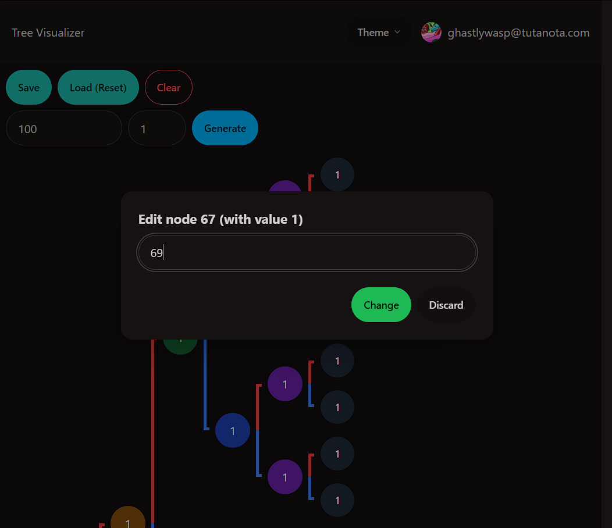

# Tree Visualizer

A binary tree visualizer built with Next.js, NestJS, MongoDB, and Clerk.

## Screenshots
<table>
	<tr>
		<td>
			
		</td>
		<td>
			
		</td>
	</tr>
	<tr>
		<td>
			
		</td>
		<td>
			
		</td>
	</tr>
</table>

## Features

- Authentication with Clerk
- CRUD operations for binary trees
- Editing nodes
- Generating random binary trees
- Saving and loading trees
- Multiple Themes (Dark, Forest, Dracula, Business, Light, Lofi, Wireframe, Winter, Cyberpunk)

> Note: Please check the [DOCS.md](DOCS.md) file for more information on the project structure and documentation.

## Getting Started

### Prerequisites

- Node.js 16.x
- MongoDB
- Clerk account

### Installation

1. Clone the repository
2. Move to the `backend` directory and run `yarn install`
3. Create a `.env` file in the root of the `backend` directory with the following content:
```
MONGODB_URI=mongodb+srv://<username>:<password>@<cluster-url>/<database-name>?retryWrites=true&w=majority
CLERK_SECRET=<clerk-secret>
```
4. Move to the `frontend` directory and run `yarn install`
5. Create a `.env` file in the root of the `frontend` directory with the following content:
```
NEXT_PUBLIC_CLERK_API_KEY=<clerk-api-key>
NEXT_PUBLIC_CLERK_API_SECRET=<clerk-api-secret>
NEXT_PUBLIC_CLERK_FRONTEND_API_KEY=<clerk-frontend-api-key>
NEXT_PUBLIC_CLERK_FRONTEND_API_SECRET=<clerk-frontend-api-secret>
CLERK_SECRET=<clerk-secret>
```
6. Run the application with `yarn dev` in the root of the `frontend` directory and `yarn start:dev` in the root of the `backend` directory
7. Open `http://localhost:3000` in your browser to access the application

## License

This project is licensed under the MIT License.	
